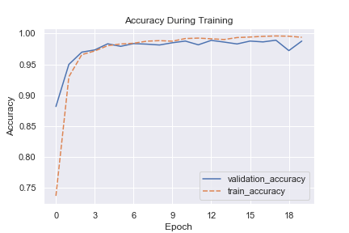
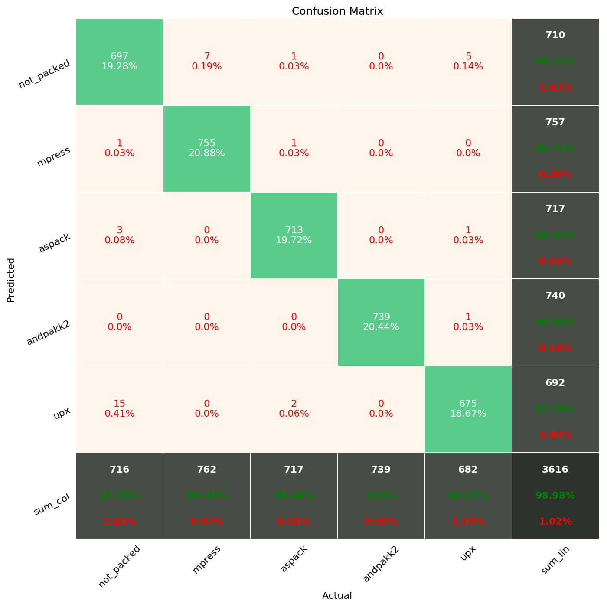

# Packed File Analysis
The goal of this project is to assess the viability of accurately detecting specific file packers using Machine Learning.  The hypothesis is that a neural network architecture will be able to take in a large number of raw bytes from packed files and learn patterns sufficient for accurate classification without the need for manual feature engineering.
 
## Project Structure
There are three main parts to this project.
1. Profiling PE files.
1. Packing PE files.
1. Multi-class Classifier for packed files.

### 1. Profiling PE Files
Implemented in profiler.py.  Takes in a directory containing files and returns basic file triage information similar to the metadata from VirusTotal.
* File Type (output of file command)
* PE metadata (imports, exports, sections, resources, code signing, strings summary)
* Exif metadata
* Yara rule evaluation

The output is written to a file and sent to a local Elasticsearch instance.
```
usage: profiler.py [-h] [-d DIRECTORY] [-f FILE] [-t TEMP_DIRECTORY]
                   [-yr YARA_RULES] [-fd FULL_DETAILS] [-o OUTPUT_DIRECTORY]
                   [-l LABEL]

Parses metadata from files and stores them in log files.

optional arguments:
  -h, --help            show this help message and exit
  -d DIRECTORY, --directory DIRECTORY
                        Directory containing files to analyze.
  -f FILE, --file FILE  Path to a specific file to analyze.
  -t TEMP_DIRECTORY, --temp_directory TEMP_DIRECTORY
                        Where temporary work area is created while processing
                        files if needed (compressed files).
  -yr YARA_RULES, --yara_rules YARA_RULES
                        Path to yara rules to use with analysis.
  -fd FULL_DETAILS, --full_details FULL_DETAILS
                        Full details will include a large nested json object.
  -o OUTPUT_DIRECTORY, --output_directory OUTPUT_DIRECTORY
                        (Optional) Directory to save parsed data to. Default
                        is current directory.
  -l LABEL, --label LABEL
                        (Optional) Tag results with this column and include in
                        output filename.
```

Example:
```
python profiler.py -d "E:\data\packed_malware_gatech\packed_mpress\00000" -t "E:\data\packed_malware_gatech\temp" -o "E:\data\packed_malware_gatech\profiler_data" -l mpress
```

### 2. Packing PE Files
This functionality was implemented in packer.py 

Packing PE files was implemented in a local Windows Virtual Machine with python 3.6 installed and no network access as a precaution.  The operation of this script works as follows:
1. The script needs a directory of the files to pack (it will recursively gather a list all files in the directory and sub-directories).
1. Next it runs multiple processes in parallel, each handling one file.
1. Each original executable is copied to a temporary space, as many of the tools operate off of disk and some overwrite the original file provided.
1. Some checks are performed to confirm the packing appeared to be successful, minimally this is a check that the hash of the file changed.
1. The new file is saved in an output directory provided, with the filename being the same as the new hash value.

```
usage: packer.py [-h] [-d DIRECTORY] [-f FILE] [-o OUTPUT_DIRECTORY]
                 [-t TEMP_DIRECTORY] [-p PACKERS] [-c CPUS]

Parses metadata from files and stores them in log files.

optional arguments:
  -h, --help            show this help message and exit
  -d DIRECTORY, --directory DIRECTORY
                        Directory containing files to analyze (will recurse to
                        sub directories).
  -f FILE, --file FILE  Path to a specific file to analyze.
  -o OUTPUT_DIRECTORY, --output_directory OUTPUT_DIRECTORY
                        Base directory where results will be stored.
  -t TEMP_DIRECTORY, --temp_directory TEMP_DIRECTORY
                        Where temporary work area is created while processing
                        files.
  -p PACKERS, --packers PACKERS
                        Comma separated list of packers to apply, or "all" to
                        run all supported packers
  -c CPUS, --cpus CPUS  Number of processors to run in parallel. Will use all
                        available if not specified.

```

Note: Several of the packers wrote temporary files in places like %TEMP% and the python script continuously attempts to clean any remnants of temp files left behind to avoid filling disk.

Note: a powershell one-liner to kill any WerFault open windows helps keep the desktop tidy.  Recommend running it in the background, as several of the packers fail frequently and display numerous failure popups.

### 3. Classifying PE Files
Implemented in model.py.  This script can be used for training a model as well as predictions, loading a saved model.

Model Training Features:
 * By default this script will attempt to train a new model if just provided with a directory of files to process.
 * The labels for those files are discovered by the directory path to the file and the list of text strings in the global variable "CLASSES".
 * As the model is being trained it writes checkpoint saves to a checkpoint directory with each epoch.
 * The final model is saved to the saved_models directory and with a name containing any provided tag from the command line options.
 * Finally, it will output a confusion matrix plot.  If a tag is provided, it will add it into the saved plot's file name.

To make predictions with the model, just provide it a directory and add the -p flag.  If there are multiple saved models in the saved_models directory, you can use the "tag" command line argument to specify which model to use.

```
usage: model.py [-h] [-d DIRECTORY] [-t TAG] [-e EPOCHS] [-p]

By default will build a new model or optionally can make predictions given a
directory of files.

optional arguments:
  -h, --help            show this help message and exit
  -d DIRECTORY, --directory DIRECTORY
                        Directory containing files to analyze (will recurse to
                        sub directories).
  -t TAG, --tag TAG     Distinct tag that can be used as a label on saved
                        models and saved results.
  -e EPOCHS, --epochs EPOCHS
                        Number of epochs used in training (default = 20)
  -p, --predict         When set, this flag indicates we want to make model
                        predictions, rather than train a new model. Optionally
                        used with a tag to specify portion of model name to
                        load when predicting.
```

## Results
This proof of concept was initially tested with a dataset of 18k labeled files and five classes ("not packed", "mpress", "UPX", "Aspack", and "andpakk2").  Plan on testing this with a larger dataset with a few hundred thousand files and coverage for at least 10 packing tools in the near future.





